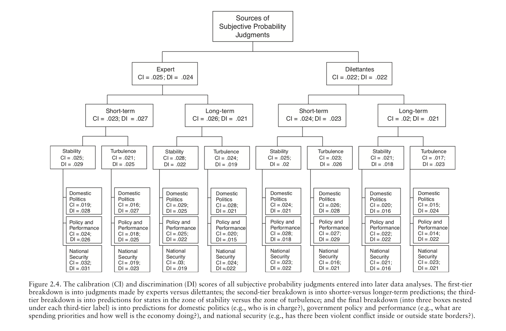

Here is Tetlock Fig 2.4, which compares the discrimination and calibration for different sets of predictions.



Now let's load in the data and make some graphs.

```{r}
rm(list = ls())
library(tidyverse)
data <- read_csv("Tetlock_expert_2005_fig2-4.csv")
data <- data %>%
  mutate(Term = as_factor(Term)) %>%
  mutate(Environment = as_factor(Environment)) %>%
  mutate(Domain = as_factor(Domain)) %>%
  mutate(Metric = as_factor(Metric))
```


```{r}
data %>% 
  filter(Metric == "Calibration") %>%
  ggplot(aes(Environment, Domain)) +
  geom_raster(aes(fill = Score)) + 
  scale_fill_gradient(low = "white", high = "red") + 
  facet_grid(Expertise ~ Term) +
  ggtitle("Calibration, lower scores are better", subtitle = "Canadian CIA calibration= 0.014, Mandel and Barnes (2014)")
```

I don't see strong obvious patterns in the calibration results.

```{r}
data %>% 
  filter(Metric == "Discrimination") %>%
  ggplot(aes(Environment, Domain)) +
  geom_raster(aes(fill = Score)) + 
  scale_fill_gradient(low = "red", high = "white") + 
  facet_grid(Expertise ~ Term) +
  ggtitle("Discrimination, higher scores are better")
```
I don't see strong obvious patterns in the discrimination results.
